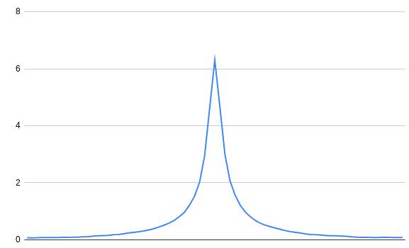

# Summary

This project is an attempt at a FHE implementation of the local ancestry
inference algorithm outlined in the following paper:

Benet Oriol Sabat, Daniel Mas Montserrat, Xavier Giro-i-Nieto, Alexander G Ioannidis, SALAI-Net: species-agnostic local ancestry inference network, Bioinformatics, Volume 38, Issue Supplement_2, September 2022, Pages ii27–ii33,

Given a set of human populations (or that of any other species) and an
individual with ancestors from these populations, ancestry inference
attempts to deduce which part of the individual's genetic code comes from
which population.

Example populations are "Southern Chinese", "West African", etc.

# Installation

Running the scripts requires Python 3.

To install the dependencies, run

    pip install -r requirements.txt
    pip install -U pip wheel setuptools
    pip install concrete-python

# Usage

Download the data files from this link into a directory of your choice.

The following command lines assume that the data files are in a directory
named _data_ in the main directory of this project and that you're running
the scripts from this main directory.

https://drive.google.com/drive/folders/1lN6AR6wpGi6NhTptFkP1I3GmUEyhEw7J?usp=drive_link

For inference, run

    python3 src/ancestry.py \
        --infer \
        --model-parameters data/model_parameters.pickle \
        --reference-panel-samples data/reference_panel_samples.vcf.gz \
        --reference-panel-mapping data/reference_panel_mapping.csv \
        --query-samples data/test_samples.vcf.gz

--infer performs ancestry inference in actual FHE on the admixed test
samples. (An individual's genetic data is called a sample.)

For testing, run

    python3 src/ancestry.py \
        --test \
        --model-parameters data/model_parameters.pickle \
        --reference-panel-samples data/reference_panel_samples.vcf.gz \
        --reference-panel-mapping data/reference_panel_mapping.csv \
        --test-samples data/test_samples.vcf.gz \
        --test-mapping data/test_mapping.pickle.gz

--test runs both the original algorithm on plaintext data and the modified
algorithm in FHE and compares their performance and accuracy. 

# The use case

A realistic use case is that a person who already has their genetic code
sequenced wants to learn their ancestry in terms of percentages. Something
like 12% West African, 34% East African, 5% East Asian, etc.

Services like 23andMe offer cheap an easy sequencing so this kind of data
is widely available.

There are three typical reasons for using such a service:
to find relatives among other customers, to find biomarkers of genetic
diseases (such as predisposition to certain types of cancer), or to learn
one's ancestry composition. Because of the different use cases some
secondary services offer further processing of the genetic data beyond
the scope of the original sequencer.

It is inevitable that the company that does the actual sequencing learns
or can potentially learn the customer's genetic data. However, it is
desirable to prevent any further services from even the remote possibility
of learning it as genetic data is a particularly sensitive piece of personal
information.

Our imagined use case is a privacy focused online service where users
can upload their genetic data and learn their ancestry composition without
revealing any sensitive information to the service.

# The algorithm

The algorithm outlined in the above paper is actually very simple.

For each population in question we have a set of "pure blooded" individual
for reference. The full set of these reference individuals is called the
reference panel.

Additionally, we have the genetic code of the user.

We'll use the data of chromosome 22 for inference. There are actually two
chromosomes 22 in every (diploid) cell: one from the mother and one from
the father, respectively. These are called homologous chromosomes. From
now on, we'll just use one of these homologous chromosomes for demonstration.
The inference algorithm doesn't distinguish between them, and composition
is calculated as the average of both.

For the purposes of this algorithm a chromosome is a vector of 1's
and 0'. Each index in the vector contains the genetic variation at that
position. There can be more than two variations in a population but
typically, there is one majority variation and one minority variation.
The limitation of the algorithm is that it can't handle positions
with more than two variations.

The values (1's and 0's) are called single nucleotide polymorphisms
(SNPs for short).

We have two of these vectors for each individual in the reference panel
and two for the user (two, becuase of the two homologous chromosomes).

Consider the following example:

    Reference individuals:
    [1 0 1 1 0 1 0 0 0 1 0 0 ...
    [1 0 1 0 1 1 0 0 0 1 1 0 ...
    ...

    User:
    [1 0 1 1 1 1 0 0 0 1 0 0 ...

Step 1. The first step, which will come in handy during the FHE implementation
is to turn these vectors of 1's and 0's into vectors of 1's and -1's by
multiplying them by 2 and subtracting 1 at each position.

    Reference panel:
    [1 -1  1  1 -1  1 -1 -1 -1  1 -1 -1 ...
    [1 -1  1 -1  1  1 -1 -1 -1  1  1 -1 ...
    ...

    User:
    [1 -1  1  1  1  1 -1 -1 -1  1 -1 -1 ...

Step 2. We multiply the reference panel by the individual at each index:

    [1  1  1  1 -1  1  1  1  1  1  1  1 ...
    [1  1  1 -1  1  1  1  1  1  1 -1  1 ...
    ...

Now we have the SNP matches at each position for each reference panel
individual. 1 means there is a match at that position, -1 means that
they differ at that position.

Step 3. The next step is to divide these vectors into windows and sum the
1, -1 encoded SNPs in each window. The more 1's there are in a window
the more similar these windows are. This is essentially a distance
metric. The window size in 200 but we will use a window of 3 SNPs
for demonstration.

    [ 3 1 3 3 ...
    [ 3 1 3 1 ...
    ....

Step 4. The next step is to iterate over the reference individuals of each
population and find the highest score for each window.

    [ 3 1 3 3 ...
    ...

This is done for each population separately. At this point, we have
N vectors of window similarity scores where N is the number of populations
in the reference panel.

The summation reduces the length of the vectors by 200 (the window size)
and the max pooling reduces their number to N. N is 7 in the original
paper.

Step 5. Once we have these similarity scores we use afilter of size 75 to
smooth them out. The size 75 is in terms of windows, that is, it smooths out
the scores of 75 window similarity scores. The smoothing filter looks like
this:

    Population 0:   [ 178 166 156 ...
    Population 1:   [ 180 165 161 ...
    Population 2:   [ 167 143 176 ...

Step 6. Now we have the smoothed out similarity scores for each window. Next,
we collect the population number of the highest value (not the highest
value itself) at each SNP to get a prediction of the provenance of
that window 

    Population 0:   [ 178 166 156 ...
    Population 1:   [ 180 165 161 ...
    Population 2:   [ 167 143 176 ...
    ...
                    --------------------
                    [    1  0   2 ...   

Step 7. The last step is to upsample the windows, that is, to repeat the window
predictions 200 times to get a prediction for each SNP.

    [ 1 1 1 1 ... 1 1 1 0 0 0 .... 0 0 0 2 2 2 ... 2 2 2 ...

# Sample data

We used custom written code to simulate recombination of individuals.
(Not included in the repository due to the throwaway nature of it.)

The founding individuals and their labeling come from the 1000 Genomes
Project.

The recombination algorithm roughly follows biological mechanisms but
lacks a large degree of realism. For better results, a dedicated solution
such as simuPOP could be used.

We simulated 32 generations of individuals from 5 superpopulations.
Superpopulations are a high level of hierarchy whereas populations
are more numerous and represent a more fine grained classification
of human beings. "East Asian" is a superpopulation, "Southern Chinese"
is a population.

The reference panel consists of 20 samples per superpopulation.

# Implementation in FHE

A thing to note is that we don't need Concrete ML to implement this
algorithm. It's more data processing than machine learning. The only
thing to train here is the smoothing kernel but we already know it's a
smoothing kernel, and the authors claim that it is universal to the
point it's actually species agnostic.

The challenge in implementing this algorithm in FHE is the large
amount of data that needs to be processed.

While experimenting with possible implementation strategies it quickly
became clear that vector arithmetic is fast but any type of comparison
is very expensive.

Steps 1, 2, 3, and 5 can be realistically implemented with pointwise
multiplication and _fhe.conv_ but the max pooling steps increase the
execution time by multiple orders of magnitude. After implementing step 4
with _fhe.maxpool_ the predicted execution time went from 4 minutes to 
about 500 hours on a consumer laptop. (It was about 50 hours with 2 reference
samples per population and the execution time seems to scale linearly with
this number.)

An actual implementation would probably run on better hardware but this
performance degradation is still unacceptable. Neither reducing the
reference panel size, nor increasing the windows size, nor running the
algorithm on a fraction of the actual data would have resulted in a
fast enough implementation.

In order to arrive at a practical implementation the following compromises
were made:

1. Only steps 2 and 3 are done on the server, the rest of the steps are
performed by the client.

2. _global_p_error_ is set to 0.01 because the computations are robust
and getting an incorrect results is not a serious problem.

3. We use a single individual per reference populations to remove the
need for max pooling.

This way, we trade some data traffic for speed because we need to return
each window score of each population to the client for further processing.

An advantage of this approach is that most steps can be reused from the
plaintext implementation and we don't have to quantize the smoother.

The data that travels from the server to the client is about 150 megabytes
per inference which is acceptable.

Furthermore, due to the length of the vectors in question (about 1.2
million SNPs) one circuit can't handle the full vectors (the process
seems to be killed by the OS).

Because of this, a batching mechanism was implemented. Both the user's
vector and the reference panel vector are divided into batches and
a circuit for each batch is precompiled on the server before accepting
requests from the client.

# Results

The output of the test run:

    Summary
        Number of samples: 100
    
        Performance
            Clear:                   2.44 s/sample
            FHE (including setup):   247.93 s/sample
            FHE (excluding setup):   227.57 s/sample
    
        Accuracy
            Clear: 95.1 %
            FHE:   28.8 %

These numbers were achieved on a regular consumer laptop.
